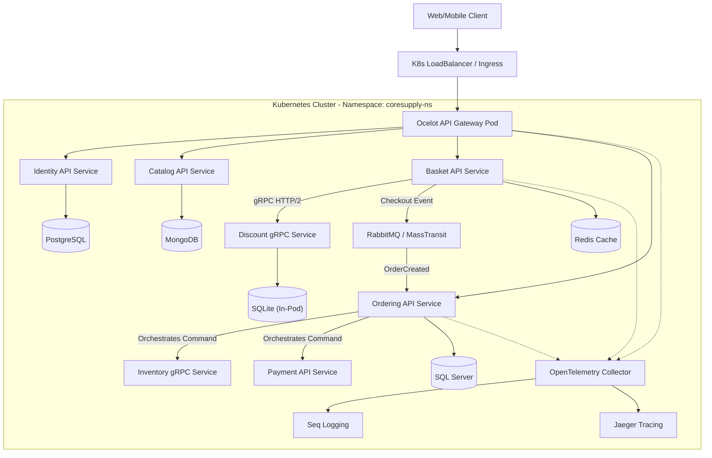
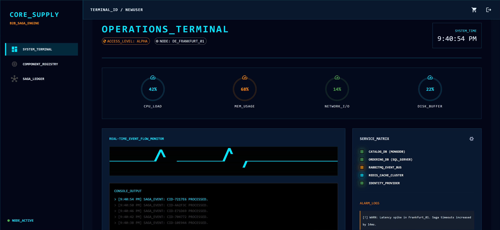
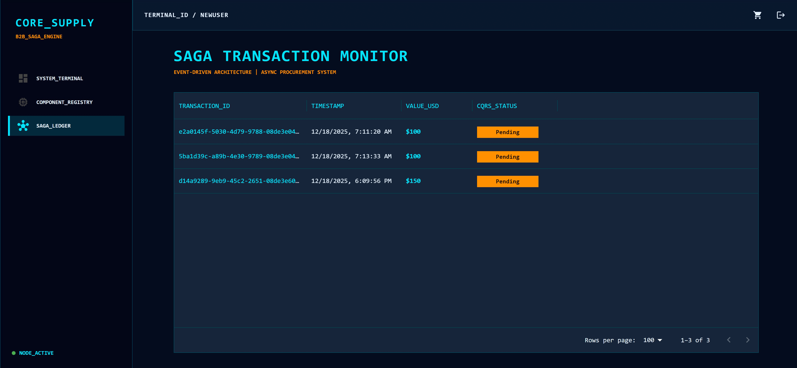
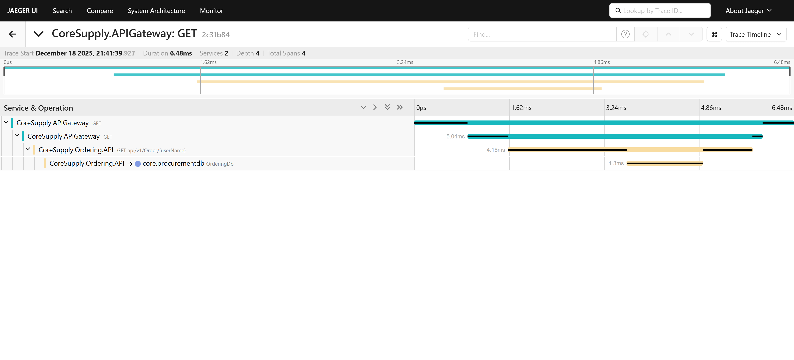

# 🏭 CoreSupply | Cloud-Ready .NET 8 Microservices & Industrial B2B Platform

<!-- Core Tech Stack & Infrastructure -->
[](https://dotnet.microsoft.com/)
[](https://reactjs.org/)
[](https://www.typescriptlang.org/)
[](https://vitejs.dev/)
[](https://mui.com/)
[-326ce5?style=flat-square&logo=kubernetes)](https://kubernetes.io/)
[](https://www.docker.com/)
[](https://github.com/amirhosein2015/CoreSupply)

<!-- Polyglot Persistence (Databases) -->
[](https://redis.io/)
[](https://www.mongodb.com/)
[](https://www.microsoft.com/sql-server)
[](https://www.postgresql.org/)

<!-- Architecture Patterns (Principal Engineering) -->
[](https://github.com/amirhosein2015/CoreSupply)
[](https://masstransit.io/documentation/patterns/saga)
[](https://learn.microsoft.com/en-us/dotnet/architecture/microservices/microservice-ddd-cqrs-patterns/)

<!-- Communication & Observability -->
[](https://masstransit.io/)
[-333333?style=flat-square&logo=grpc)](https://grpc.io/)
[](https://opentelemetry.io/)

<!-- Quality Assurance & License -->
[](https://github.com/amirhosein2015/CoreSupply/actions/workflows/dotnet-ci.yml)
[](https://xunit.net/)
[](LICENSE)


> **An enterprise-grade, production-ready distributed system engineered to solve mission-critical supply chain challenges using modern Cloud-Native standards.**

**CoreSupply** is not a simple CRUD application; it is a high-performance **production-ready distributed system** meticulously architected for the **DACH and Netherlands B2B markets**. The platform leverages **Microservices**, **Event-Driven Architecture**, and **Kubernetes Orchestration** to deliver a resilient, loosely coupled infrastructure capable of handling industrial-scale procurement workflows.

This project serves as a comprehensive demonstration of **Principal-level engineering**, showcasing the seamless integration of **Saga Orchestration**, **Distributed Tracing**, and **Resilient Cloud Deployment** within a highly observable ecosystem.


---
## Problem Statement

Modern industrial supply chains — especially in sectors such as automotive, manufacturing, and large-scale distribution — face complex challenges in parts procurement, inventory coordination, and multi-party fulfillment workflows across factory and enterprise environments. Traditional monolithic procurement systems are often brittle, difficult to scale, and incapable of supporting distributed orchestration, eventual consistency, and operational transparency required for modern industrial and production-driven systems.

CoreSupply addresses these challenges by providing a cloud-native, microservices-based platform that enables resilient, scalable, and observable procurement workflows across business domains and factory operations. Using a combination of synchronous and asynchronous communication patterns, distributed transaction management (Saga orchestration), and advanced observability with end-to-end tracing and centralized logging, CoreSupply serves as a production-ready, enterprise-grade foundation for B2B parts supply systems operating in industrial and manufacturing contexts.

This platform is designed to support engineering teams building sophisticated supply chain and factory-integrated solutions for industries such as automotive manufacturing, industrial equipment production, and logistics, where reliability, extensibility, maintainability, and cloud readiness are critical to sustained operational excellence.

---
## 🏗️ High-Level Architecture (Kubernetes Cluster)

The system follows **Clean Architecture** principles and is deployed as a set of scalable pods within a **Kubernetes Cluster**, using a hybrid communication strategy (**Sync gRPC** for speed, **Async Messaging** for consistency).


---

## 🚀 Engineering Excellence & Architectural Depth

This project serves as a technical deep-dive into **Enterprise-grade engineering patterns**, demonstrating the practical implementation of complex architectural decisions required for **scalable, production-ready distributed systems**.

### **1. Architecture & Design**
*   **Microservices:** Fully autonomous services with **Polyglot Persistence** (Mongo, SQL Server, Postgres, Redis, SQLite).
*   **Domain-Driven Design (DDD):** Rich domain models, Aggregates, and Value Objects implemented in the *Ordering Service*.
*   **CQRS:** Command Query Responsibility Segregation using **MediatR** to separate read/write concerns.
*   **Clean Architecture:** Strict separation of concerns (Domain, Application, Infrastructure, API).

### **2. Communication & Messaging**
*   **Event-Driven Architecture:** Asynchronous inter-service communication using **RabbitMQ** and **MassTransit**.
*   **Saga Orchestration:** Distributed Transaction Management (Order -> Inventory -> Payment) using **MassTransit State Machine**.
*   **Synchronous gRPC:** High-performance inter-service communication between *Basket* and *Discount* using ProtoBuf and HTTP/2.
*   **API Gateway:** Unified entry point using **Ocelot** for routing and aggregation.

### **3. Observability & DevOps**
*   **Distributed Tracing:** Full end-to-end request tracing using **OpenTelemetry** and **Jaeger**.
*   **Centralized Logging:** Structured logging aggregation using **[Serilog configuration](./CoreSupply.BuildingBlocks/Logging/LoggingExtensions.cs)** and **Seq**.
*   **Docker Compose:** Zero-config deployment via [docker-compose.yml](./docker-compose.yml).
*   **Deep Dive:** 👉 **[Read the Observability Guide](./docs/observability/observability-guide.md)**.

### **4. System Resilience**
*   **Fault Tolerance:** Implemented **Polly** retry policies inside [Ordering Program.cs](./CoreSupply.Ordering.API/Program.cs).
*   **Compensation Logic:** Automatic rollback (e.g., releasing stock if payment fails) handled by the Saga State Machine.
*   **Self-Healing:** Database migration and seeding strategies that handle container restarts gracefully.
*   **Deep Dive:** 👉 **[Read the Resilience & Fault Tolerance Guide](./docs/architecture/resilience-patterns.md)**.

### **5. Quality Assurance**
*   **Integration Testing:** Automated end-to-end testing using **[Testcontainers implementation](./CoreSupply.IntegrationTests/Fixtures/IntegrationTestWebAppFactory.cs)**.
*   **Unit/Integration Scenarios:** See **[OrderTests.cs](./CoreSupply.IntegrationTests/Fixtures/OrderTests.cs)** for real-world testing examples.
*   **Deep Dive:** 👉 **[Read the full Testing Strategy Guide](./docs/architecture/testing-strategy.md)** to understand how we handle CI/CD vs Local environments.

### **6. Security Architecture**
*   **Identity & Access:** Centralized JWT authentication with Refresh Token Rotation and RBAC authorization.
*   **Secrets Management:** Environment-based configuration following 12-Factor App principles (no hardcoded secrets).
*   **Deep Dive:** 👉 **[Read the Security Architecture Guide](./docs/architecture/security-architecture.md)**.

### **7. Cloud Infrastructure & DevOps**
*   **Kubernetes (K8s):** Full production-grade deployment manifests including `Deployments`, `Services`, `Secrets`, and `ConfigMaps`.
*   **Infrastructure as Code (IaC):** Declarative YAML configuration for the entire stack (Infrastructure + Application).
*   **Ingress Controller:** Traffic management and routing handled natively within the cluster.
*   **Deep Dive:** 👉 **[Explore the Kubernetes Manifests](./k8s/)** to see how we manage stateful and stateless workloads.

### **8. Industrial Command Portal (Frontend Architecture)**

*   **Cyber-Industrial UI/UX:** Engineered a high-density "Operations Terminal" using **React 18** and **TypeScript (Strict Mode)**, prioritizing data visibility and professional B2B engineering aesthetics.
*   **Modular Architecture:** Implemented a DDD-inspired directory structure (**App, Domain, Infrastructure**) to ensure the frontend scales predictably alongside the backend microservices.
*   **System Telemetry:** Developed SVG-based **Heartbeat Monitors** and **Active Status LEDs** to simulate real-time health checks and node connectivity across the distributed network.

### **9. Full-Stack Integration & Security Standards**

*   **Gateway-Level CORS Enforcement:** Implemented production-ready **Cross-Origin Resource Sharing (CORS)** policies within the **Ocelot API Gateway** to secure the communication bridge between the React SPA and the microservices mesh.
*   **State Synchronization:** Designed a resilient workflow that triggers **Saga Orchestration** while executing automated **Client-Side Cache Management** upon order initiation.
*   **Axios Interceptors:** Robust networking layer featuring automated JWT injection, Refresh Token rotation handling, and global error interceptors for unified system feedback.

### **10. Advanced UI Orchestration**

*   **Global State Management:** Centralized management of complex domain states (Identity, Basket, Notifications) using the **React Context API**, ensuring high performance in decoupled UI environments.
*   **Industrial Data Management:** Leveraged optimized **Material UI DataGrids** to handle large-scale component registries and SAGA transaction histories with high-performance rendering.
*   **Async Notification System:** Built a centralized **Toast/Snackbar Provider** to handle non-blocking asynchronous feedback from distributed background operations.

---

### **🚀 Deep Dive: Distributed Saga Orchestration**

One of the most complex challenges in distributed systems is managing transactions across multiple services. CoreSupply implements the **Orchestration-based Saga Pattern** using MassTransit State Machines to ensure data consistency.

**The Workflow (Order Fulfillment):**
1.  **Order Created:** The user checks out, and the order is saved in `Pending` state.
2.  **Orchestrator Starts:** The `OrderStateMachine` in *Ordering.API* initiates the transaction.
3.  **Inventory Check:** A command is sent to *Inventory Service*.
    *   ✅ Success: Proceeds to payment.
    *   ❌ Failure: Saga ends, Order marked as `Cancelled`.
4.  **Payment Processing:** A command is sent to *Payment Service*.
    *   ✅ Success: Order marked as `Completed`.
    *   ❌ Failure: **Compensation Action** triggers -> A `ReleaseStock` command is sent to Inventory to roll back the reservation.

> **Why Orchestration?** Unlike Choreography, this approach centralizes the business logic, making it easier to monitor, debug, and manage complex workflows with rollbacks.

---
## 🛠️ How to Run

You have two options to run CoreSupply: **Docker Compose** (Quick Start) or **Kubernetes** (Production Simulation).

### Prerequisites
*   [Docker Desktop](https://www.docker.com/products/docker-desktop) (Linux Containers mode).
*   **For K8s:** Enable Kubernetes in Docker Desktop settings.

---

## 🛠️ Deployment & Mission Control

You can evaluate the **CoreSupply** ecosystem using two primary orchestration methods: **Docker Compose** (for rapid local evaluation) or **Kubernetes** (for production-grade simulation).

### **🟢 Option 1: Docker Compose (Quick Start)**
*Best for rapid evaluation of the full-stack microservices mesh and real-time observability.*

1.  **Clone & Launch:**
    ```bash
    git clone https://github.com/amirhosein2015/CoreSupply.git
    cd CoreSupply
    docker-compose up -d --build
    ```
    *Note: Please allow ~60 seconds for SQL Server and RabbitMQ to stabilize after the containers start.*

2.  **🚀 Mission Control Entry Points:**
    *   **Industrial UI Portal:** [http://localhost:3000](http://localhost:3000) (React 18 Command Center)
    *   **Unified API Gateway:** [http://localhost:9000](http://localhost:9000) (Ocelot Ingress)
    *   **Identity Management:** [http://localhost:9003/swagger](http://localhost:9003/swagger) (Direct API Access)
    *   **Distributed Tracing:** [http://localhost:16686](http://localhost:16686) (Jaeger UI)
    *   **Event Bus Monitor:** [http://localhost:18672](http://localhost:18672) (RabbitMQ Console - guest/guest)
    *   **Log Dashboard:** [http://localhost:9880](http://localhost:9880) (Seq - admin/Password12!)

---

### **🔵 Option 2: Kubernetes (Production Simulation)**
*Best for validating K8s orchestration, self-healing capabilities, and cloud-native resilience.*

1.  **Setup Cluster Infrastructure:**
    ```bash
    kubectl apply -f k8s/0-namespace.yaml
    kubectl apply -f k8s/0-secrets.yaml
    kubectl apply -f k8s/1-infrastructure/
    ```

2.  **Deploy Microservices Mesh:**
    ```bash
    kubectl apply -f k8s/2-services/
    ```

3.  **Establish Secure Ingress:**
    ```bash
    kubectl port-forward svc/api-gateway 9000:80 -n coresupply-ns
    ```
    *The Industrial UI (running on Port 3000) will communicate with the cluster via the forwarded Gateway.*

---

### **🔑 Demo Credentials (Quick Access)**
*Use these verified accounts to explore the Saga Ledger and Industrial Component Registry without registration.*

| Role | Username / Email | Password | Access Level |
| :--- | :--- | :--- | :--- |
| **Procurement Manager** | `newuser@test.com` | `Password123!` | System Terminal & Registry |
| **Logistics Operator** | `ali@example.com` | `Password123!` | Order Tracking & Ledger |

> **System Note:** If the local database is reset, you can instantly register a new industrial account through the UI or the [Identity Swagger UI](http://localhost:9003/swagger).

---

### **🛡️ Technical Troubleshooting (Windows Users)**
If you encounter `Port 9000/9003 is already in use` (a common Windows WinNAT port reservation conflict), execute the following commands in an **Administrator CMD**:
```cmd
net stop winnat
docker-compose up -d
net start winnat
```
---
## 📸 Visual Evidence

### **1. Industrial Operations Terminal**
*The React 18 command center featuring real-time system vitals, heartbeat telemetry, and a high-density industrial interface.*


### **2. Logistics & SAGA Ledger**
*A centralized view of distributed transactions across the microservices mesh, demonstrating eventual consistency tracking.*


### **3. Distributed Tracing (Jaeger)**
*End-to-End trace visualization of the Saga transaction (Basket ➔ Order ➔ Inventory ➔ Payment). Shows the exact latency and path of the request across microservices.*


### **4. Observability Dashboard (Seq)**
*Real-time structured logging aggregation from all microservices, allowing for deep filtering and debugging.*


### **5. Automated Integration Tests**
*Result of running the integration test suite, verifying the correctness of the API endpoints and database interactions.*


---


## 🔮 System Architecture Roadmap & Maturity Matrix

This roadmap outlines the evolution of **CoreSupply** from its foundational infrastructure to a fully integrated, mission-critical industrial platform.

| Phase | Status | Technical Domain | Engineering Details |
| :--- | :---: | :--- | :--- |
| **1. Foundation** | ✅ Done | Microservices Infrastructure | Docker containerization, Polyglot Persistence, RabbitMQ Event Bus. |
| **2. Security** | ✅ Done | Enterprise Identity | JWT Bearer Auth, Refresh Token Rotation, RBAC, Gateway CORS Policy. |
| **3. Communication** | ✅ Done | High-Performance RPC | gRPC integration for low-latency sync links (Basket ➔ Discount). |
| **4. Orchestration** | ✅ Done | **Distributed Sagas** | Complex state machines for transactional integrity (Order ➔ Stock ➔ Pay). |
| **5. Observability** | ✅ Done | System Telemetry | Full Distributed Tracing with OpenTelemetry, Jaeger, and Seq logging. |
| **6. Deployment** | ✅ Done | **Kubernetes (K8s)** | Production-grade manifests for auto-scaling and self-healing nodes. |
| **7. Frontend** | ✅ Done | **Industrial Operations UI** | React 18 & TypeScript Portal with Real-time Heartbeat & Logistics Ledger. |

---

## 👨‍💻 Author

**Abdollah Mohajeri**  
*Senior Software Engineer | Backend & Cloud Infrastructure Architect*

*   **Focus:** Engineering high-availability distributed systems, .NET 8 Ecosystem, and Cloud-Native Solutions.
*   **LinkedIn:** [LinkedIn Profile](https://www.linkedin.com/in/abdollah-mohajeri/)
*   **GitHub:** [amirhosein2015](https://github.com/amirhosein2015)

---
*Built with precision for the next generation of Industrial Supply Chains.*

