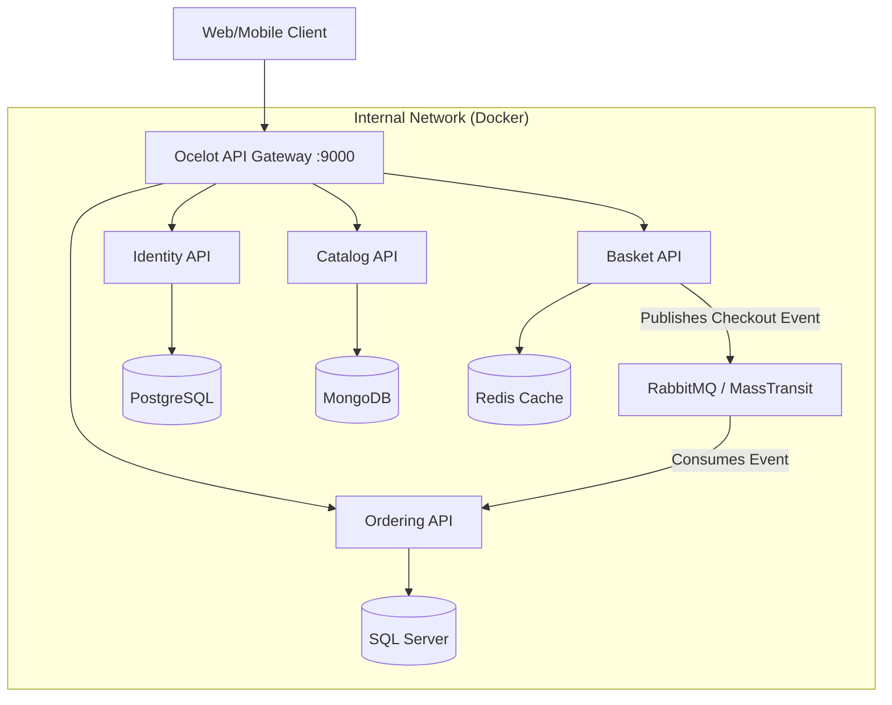

# 🏭 CoreSupply | Cloud-Native Industrial Supply Chain Platform

[](https://dotnet.microsoft.com/)
[](https://www.docker.com/)
[](https://github.com/amirhosein2015/CoreSupply)
[](LICENSE)

> **Enterprise-grade B2B solution for the DACH market, built with modern .NET 8 standards.**

**CoreSupply** is not just an e-commerce backend; it is a distributed system architected to solve complex industrial procurement challenges. Unlike traditional monoliths, it leverages **Microservices**, **Event-Driven Architecture**, and **Domain-Driven Design (DDD)** to ensure loose coupling, high scalability, and fault tolerance.


---

## 🏗️ High-Level Architecture

The system follows the **Clean Architecture** principles within each microservice and orchestrates communication via a lightweight Event Bus.



---

## 🚀 Engineering Excellence & Patterns

This project demonstrates mastery of advanced software engineering concepts required for **Senior/Principal** roles.

### **1. Architecture & Design**
*   **Microservices:** Fully autonomous services with **Polyglot Persistence** (Mongo, SQL Server, Postgres, Redis).
*   **Domain-Driven Design (DDD):** Rich domain models, Aggregates, and Value Objects implemented in the *Ordering Service*.
*   **CQRS:** Command Query Responsibility Segregation using **MediatR** to separate read/write concerns.
*   **Clean Architecture:** Strict separation of concerns (Domain, Application, Infrastructure, API).

### **2. Communication & Messaging**
*   **Event-Driven Architecture:** Asynchronous inter-service communication using **RabbitMQ** and **MassTransit**.
*   **API Gateway:** Unified entry point using **Ocelot** for routing and aggregation.
*   **Resilient Connectivity:** Retry policies and circuit breakers (via MassTransit).

### **3. DevOps & Infrastructure**
*   **Docker Compose:** Zero-config deployment of 12+ containers (Services + Databases + Broker).
*   **Port Management:** Strategic port mapping to avoid Windows Hyper-V conflicts (Safe Ports 6000+ for Infra).
*   **Infrastructure as Code:** Fully containerized environment.

---

## 🧩 Microservices Breakdown

| Service | Responsibility | Tech Stack | Database | Port |
| :--- | :--- | :--- | :--- | :--- |
| **Identity API** | Centralized Authentication (JWT) | .NET 8, Identity Core | **PostgreSQL** | 9003 |
| **Catalog API** | Product Inventory Management | .NET 8, Repository Pattern | **MongoDB** | 9001 |
| **Quote API** | Basket & B2B Quote Management | .NET 8, **MassTransit Publisher** | **Redis** | 9002 |
| **Ordering API** | Order Lifecycle (Core Domain) | .NET 8, **DDD**, **CQRS**, **Consumer** | **SQL Server** | 9004 |
| **API Gateway** | Unified Routing & Security | Ocelot | - | 9000 |

### **Shared Kernel (BuildingBlocks)**
A centralized class library that enforces standards across all microservices:
*   **CQRS Abstractions:** `ICommand`, `IQuery`, `ICommandHandler`.
*   **DDD Base Classes:** `Entity`, `AggregateRoot`, `IDomainEvent`.
*   **Behaviors:** `ValidationBehavior` (FluentValidation pipeline).

---

## 🛠️ How to Run (Zero-Config)

You don't need to install SQL Server, RabbitMQ, or Mongo locally. Docker handles everything.

### Prerequisites
*   [Docker Desktop](https://www.docker.com/products/docker-desktop) (Linux Containers mode)

### Installation
1.  **Clone the repository:**
    ```bash
    git clone https://github.com/amirhosein2015/CoreSupply.git
    cd CoreSupply
    ```

2.  **Launch the Platform:**
    ```bash
    docker-compose up -d
    ```
    *Wait ~30 seconds for databases to initialize.*

3.  **Access the System:**
    *   **Unified API Gateway:** `http://localhost:9000/catalog`
    *   **RabbitMQ Dashboard:** `http://localhost:16672` (guest/guest)
    *   **Swagger UI:** Available on ports 9001-9004.

---

## 🧪 Testing the Event-Driven Flow

To verify the asynchronous **Checkout Process** (Basket -> RabbitMQ -> Ordering):

1.  Open **Basket Swagger** (`localhost:9002`).
2.  Create a basket using `POST /api/v1/Basket`.
3.  Call `POST /api/v1/Basket/Checkout`.
4.  Check **Ordering Service Logs**:
    ```bash
    docker logs coresupply-ordering.api-1
    ```
    ✅ *Success Message:* `Order created successfully with Id: ...`

---

## 🔮 Roadmap (Principal Level Goals)

*   [x] **Core Microservices** (Identity, Catalog, Basket, Ordering)
*   [x] **Infrastructure** (Docker, SQL, Mongo, Redis, Postgres)
*   [x] **Event Bus** (RabbitMQ + MassTransit implementation)
*   [x] **API Gateway** (Ocelot Routing)
*   [ ] **Observability:** OpenTelemetry + Jaeger (Distributed Tracing) & ELK Stack.
*   [ ] **Resilience:** Polly policies (Retry, Circuit Breaker) for database reliability.
*   [ ] **Testing:** Integration tests using **Testcontainers**.
*   [ ] **CI/CD:** GitHub Actions pipelines.

---

## 👨‍💻 Author

**Amirhosein Momeni**
*   *Senior Software Engineer & Cloud Architect*
*   Focus: Distributed Systems, .NET Ecosystem, Cloud-Native Solutions.
*   GitHub: [amirhosein2015](https://github.com/amirhosein2015)

---
*Designed with ❤️ for the Industrial Sector.*
```
