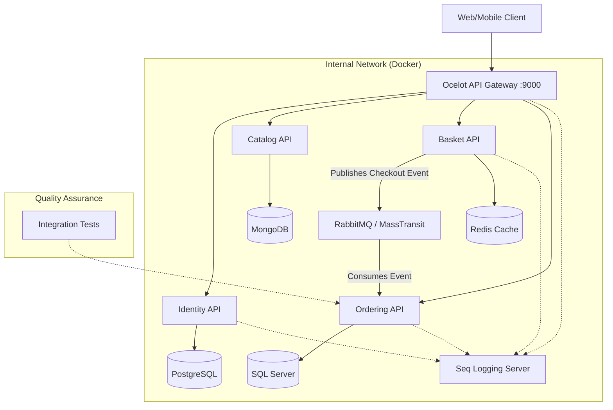
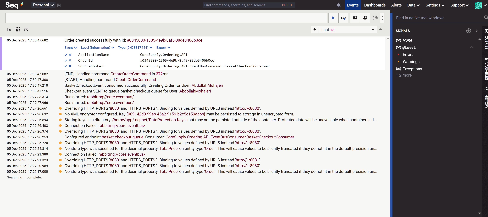
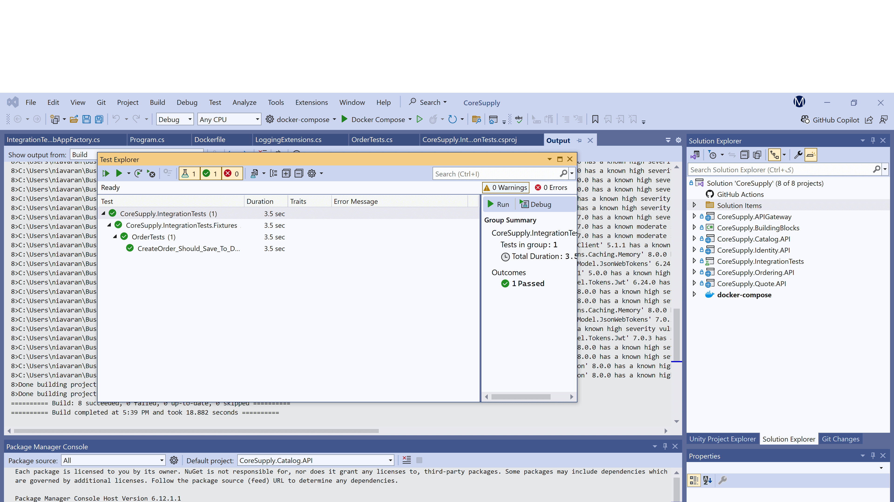

# 🏭 CoreSupply | Cloud-Native Industrial Supply Chain Platform

[](https://dotnet.microsoft.com/)
[](https://www.docker.com/)
[](https://github.com/amirhosein2015/CoreSupply/actions/workflows/dotnet-ci.yml)
[](https://github.com/amirhosein2015/CoreSupply)
[](https://xunit.net/)
[](LICENSE)

> **Enterprise-grade B2B solution for the DACH market, built with modern .NET 8 standards.**

**CoreSupply** is not just an e-commerce backend; it is a distributed system architected to solve complex industrial procurement challenges. Unlike traditional monoliths, it leverages **Microservices**, **Event-Driven Architecture**, and **Domain-Driven Design (DDD)** to ensure loose coupling, high scalability, and fault tolerance.

The primary goal of this project is to demonstrate **Principal-level** engineering practices, including robust observability, resiliency patterns, and automated integration testing.


---

## 🏗️ High-Level Architecture

The system follows **Clean Architecture** principles and uses a lightweight Event Bus for asynchronous communication.



---

## 🚀 Engineering Excellence & Patterns

This project demonstrates mastery of advanced software engineering concepts required for **Senior/Principal** roles.

### **1. Architecture & Design**
*   **Microservices:** Fully autonomous services with **Polyglot Persistence** (Mongo, SQL Server, Postgres, Redis).
*   **Domain-Driven Design (DDD):** Rich domain models, Aggregates, and Value Objects implemented in the *Ordering Service*.
*   **CQRS:** Command Query Responsibility Segregation using **MediatR** to separate read/write concerns.
*   **Clean Architecture:** Strict separation of concerns (Domain, Application, Infrastructure, API).

### **2. Communication & Messaging**
*   **Event-Driven Architecture:** Asynchronous inter-service communication using **RabbitMQ** and **MassTransit**.
*   **API Gateway:** Unified entry point using **Ocelot** for routing and aggregation.
*   **Resilient Connectivity:** Retry policies and circuit breakers (via MassTransit).

### **3. Observability & DevOps**
*   **Centralized Logging:** Structured logging aggregation using **[Serilog configuration](./CoreSupply.BuildingBlocks/Logging/LoggingExtensions.cs)** and **Seq**.
*   **Docker Compose:** Zero-config deployment via [docker-compose.yml](./docker-compose.yml).
*   **Port Management:** Strategic port mapping to avoid Windows Hyper-V conflicts (Safe Ports 6000+ for Infra). 
*   **Centralized Logging:** Structured logging aggregation using Serilog and Seq.
*   **Deep Dive:** 👉 **[Read the Observability Guide](./docs/observability/observability-guide.md)**.


### **4. System Resilience**
*   **Fault Tolerance:** Implemented **Polly** retry policies inside [Ordering Program.cs](./CoreSupply.Ordering.API/Program.cs).
*   **Performance Monitoring:** Custom **[LoggingBehavior.cs](./CoreSupply.BuildingBlocks/Behaviors/LoggingBehavior.cs)** in MediatR pipeline to track slow commands.
*   **Fault Tolerance:** Implemented **Polly** retry policies for database connections.
*   **Deep Dive:** 👉 **[Read the Resilience & Fault Tolerance Guide](./docs/architecture/resilience-patterns.md)**.

### **5. Quality Assurance**
*   **Integration Testing:** Automated end-to-end testing using **[Testcontainers implementation](./CoreSupply.IntegrationTests/Fixtures/IntegrationTestWebAppFactory.cs)**.
*   **Unit/Integration Scenarios:** See **[OrderTests.cs](./CoreSupply.IntegrationTests/Fixtures/OrderTests.cs)** for real-world testing examples.
*   **Integration Testing:** Automated end-to-end testing using a hybrid strategy (Testcontainers + InMemory).
*   **Deep Dive:** 👉 **[Read the full Testing Strategy Guide](./docs/architecture/testing-strategy.md)** to understand how we handle CI/CD vs Local environments.

### **6. Security Architecture**
*   **Identity Management:** Centralized JWT authentication with Refresh Token Rotation.
*   **Deep Dive:** 👉 **[Read the Security Architecture Guide](./docs/architecture/security-architecture.md)**.

---

## 🧩 Microservices Breakdown

| Service | Responsibility | Tech Stack | Database | Port |
| :--- | :--- | :--- | :--- | :--- |
| **Identity API** | Centralized Authentication (**JWT + Refresh Token**) | .NET 8, Identity Core, **Polly** | **PostgreSQL** | 9003 |
| **Catalog API** | Product Inventory Management | .NET 8, Repository Pattern | **MongoDB** | 9001 |
| **Quote API** | Basket & B2B Quote Management | .NET 8, **MassTransit Publisher** | **Redis** | 9002 |
| **Ordering API** | Order Lifecycle (Core Domain) | .NET 8, **DDD**, **CQRS**, **Consumer** | **SQL Server** | 9004 |
| **API Gateway** | Unified Routing & Security | Ocelot, **Polly** | - | 9000 |
| **Seq** | **Centralized Log Dashboard** | Datalust Seq | - | 5340 |

### **Shared Kernel (BuildingBlocks)**
A centralized class library that enforces standards across all microservices:
*   **CQRS Abstractions:** `ICommand`, `IQuery`, `ICommandHandler`.
*   **DDD Base Classes:** `Entity`, `AggregateRoot`, `IDomainEvent`.
*   **Cross-Cutting Concerns:** `LoggingExtensions` (Serilog config), `ValidationBehavior`, `LoggingBehavior`.

---

## 🛠️ How to Run (Zero-Config)

You don't need to install SQL Server, RabbitMQ, or Mongo locally. Docker handles everything.

### Prerequisites
*   [Docker Desktop](https://www.docker.com/products/docker-desktop) (Linux Containers mode)

### Installation
1.  **Clone the repository:**
    ```bash
    git clone https://github.com/amirhosein2015/CoreSupply.git
    cd CoreSupply
    ```

2.  **Launch the Platform:**
    ```bash
    docker-compose up -d
    ```
    *Wait ~30 seconds for databases to initialize.*

3.  **Access the System:**
    *   **Unified API Gateway:** `http://localhost:9000/catalog`
    *   **Log Dashboard (Seq):** `http://localhost:5340` (admin / Password12!)
    *   **RabbitMQ Dashboard:** `http://localhost:16672` (guest/guest)
    *   **Swagger UI:** Available on ports 9001-9004.

---

## 🧪 Testing Strategies

CoreSupply employs multiple levels of testing to ensure reliability.

### 1. Automated Integration Tests
You can run the integration tests to verify the "Create Order" flow against an isolated database.

```bash
dotnet test CoreSupply.IntegrationTests/CoreSupply.IntegrationTests.csproj
```
*Result: Verifies that the API endpoint correctly processes the command and persists data to the database.*

### 2. Manual End-to-End Event Flow
To verify the asynchronous **Checkout Process** (Basket -> RabbitMQ -> Ordering):

1.  Open **Basket Swagger** (`localhost:9002`).
2.  Create a basket using `POST /api/v1/Basket`.
3.  Call `POST /api/v1/Basket/Checkout`.
4.  **Verify via Observability (Seq):**
    *   Open **Seq Dashboard** (`http://localhost:5340`).
    *   Filter logs for `ApplicationName = "CoreSupply.Ordering.API"`.
    *   ✅ Look for success log: `Order created successfully with Id: ...`

---

## 📸 Visual Evidence

### Observability Dashboard (Seq)
*Real-time structured logging from all microservices.*


### Automated Tests Results
*Successful execution of integration tests.*


---

## 🔮 Roadmap (Principal Level Goals)

*   [x] **Core Microservices** (Identity, Catalog, Basket, Ordering)
*   [x] **Infrastructure** (Docker, SQL, Mongo, Redis, Postgres)
*   [x] **Event Bus** (RabbitMQ + MassTransit implementation)
*   [x] **API Gateway** (Ocelot Routing)
*   [x] **Observability** (Seq & Serilog Structured Logging)
*   [x] **Resilience** (Polly Retry Policies & Performance Logging)
*   [x] **Testing** (Integration Tests Infrastructure)
*   [x] **CI/CD:** GitHub Actions pipelines.
*   [x] **Security:** Secure Refresh Token Flow implemented.
*   [ ] **Advanced Security:** RBAC (Role-Based Access Control) & Secrets Management.

---

## 👨‍💻 Author

**Abdollah Mohajeri**
*   *Senior Software Engineer & Cloud Architect*
*   Focus: Distributed Systems, .NET Ecosystem, Cloud-Native Solutions.
*   GitHub: [amirhosein2015](https://github.com/amirhosein2015)

---
*Designed with ❤️ for the Industrial Sector.*
```
