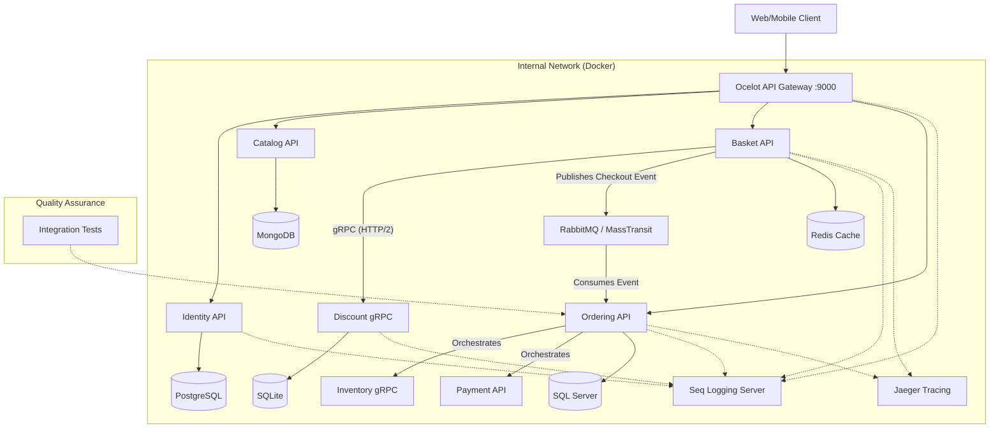

# 🏭 CoreSupply | Cloud-Native Industrial Supply Chain Platform

<!-- Tech Stack & Version -->
[](https://dotnet.microsoft.com/)
[](https://www.docker.com/)
[](LICENSE)

<!-- Architecture Patterns (The "Principal" stuff) -->
[](https://github.com/amirhosein2015/CoreSupply)
[](https://masstransit.io/documentation/patterns/saga)
[](https://learn.microsoft.com/en-us/dotnet/architecture/microservices/microservice-ddd-cqrs-patterns/)

<!-- Critical Communication Infra -->
[](https://masstransit.io/)
[-333333?style=flat-square&logo=grpc)](https://grpc.io/)

<!-- Quality & DevOps -->
[](https://github.com/amirhosein2015/CoreSupply/actions/workflows/dotnet-ci.yml)
[](https://xunit.net/)

> **Enterprise-grade B2B solution for the DACH market, built with modern .NET 8 standards.**

**CoreSupply** is not just an e-commerce backend; it is a distributed system architected to solve complex industrial procurement challenges. Unlike traditional monoliths, it leverages **Microservices**, **Event-Driven Architecture**, and **Domain-Driven Design (DDD)** to ensure loose coupling, high scalability, and fault tolerance.

The primary goal of this project is to demonstrate **Principal-level** engineering practices, including robust observability, resiliency patterns, and automated integration testing.


---

## 🏗️ High-Level Architecture

The system follows **Clean Architecture** principles and uses a hybrid communication strategy (**Sync gRPC** for speed, **Async Messaging** for consistency).



---

## 🚀 Engineering Excellence & Patterns

This project demonstrates mastery of advanced software engineering concepts required for **Senior/Principal** roles.

### **1. Architecture & Design**
*   **Microservices:** Fully autonomous services with **Polyglot Persistence** (Mongo, SQL Server, Postgres, Redis, SQLite).
*   **Domain-Driven Design (DDD):** Rich domain models, Aggregates, and Value Objects implemented in the *Ordering Service*.
*   **CQRS:** Command Query Responsibility Segregation using **MediatR** to separate read/write concerns.
*   **Clean Architecture:** Strict separation of concerns (Domain, Application, Infrastructure, API).

### **2. Communication & Messaging**
*   **Event-Driven Architecture:** Asynchronous inter-service communication using **RabbitMQ** and **MassTransit**.
*   **Saga Orchestration:** Distributed Transaction Management (Order -> Inventory -> Payment) using **MassTransit State Machine**.
*   **Synchronous gRPC:** High-performance inter-service communication between *Basket* and *Discount* using ProtoBuf and HTTP/2.
*   **API Gateway:** Unified entry point using **Ocelot** for routing and aggregation.

### **3. Observability & DevOps**
*   **Distributed Tracing:** Full end-to-end request tracing using **OpenTelemetry** and **Jaeger**.
*   **Centralized Logging:** Structured logging aggregation using **[Serilog configuration](./CoreSupply.BuildingBlocks/Logging/LoggingExtensions.cs)** and **Seq**.
*   **Docker Compose:** Zero-config deployment via [docker-compose.yml](./docker-compose.yml).
*   **Deep Dive:** 👉 **[Read the Observability Guide](./docs/observability/observability-guide.md)**.

### **4. System Resilience**
*   **Fault Tolerance:** Implemented **Polly** retry policies inside [Ordering Program.cs](./CoreSupply.Ordering.API/Program.cs).
*   **Compensation Logic:** Automatic rollback (e.g., releasing stock if payment fails) handled by the Saga State Machine.
*   **Self-Healing:** Database migration and seeding strategies that handle container restarts gracefully.
*   **Deep Dive:** 👉 **[Read the Resilience & Fault Tolerance Guide](./docs/architecture/resilience-patterns.md)**.

### **5. Quality Assurance**
*   **Integration Testing:** Automated end-to-end testing using **[Testcontainers implementation](./CoreSupply.IntegrationTests/Fixtures/IntegrationTestWebAppFactory.cs)**.
*   **Unit/Integration Scenarios:** See **[OrderTests.cs](./CoreSupply.IntegrationTests/Fixtures/OrderTests.cs)** for real-world testing examples.
*   **Deep Dive:** 👉 **[Read the full Testing Strategy Guide](./docs/architecture/testing-strategy.md)** to understand how we handle CI/CD vs Local environments.

### **6. Security Architecture**
*   **Identity & Access:** Centralized JWT authentication with Refresh Token Rotation and RBAC authorization.
*   **Secrets Management:** Environment-based configuration following 12-Factor App principles (no hardcoded secrets).
*   **Deep Dive:** 👉 **[Read the Security Architecture Guide](./docs/architecture/security-architecture.md)**.

---

### **🚀 Deep Dive: Distributed Saga Orchestration**

One of the most complex challenges in distributed systems is managing transactions across multiple services. CoreSupply implements the **Orchestration-based Saga Pattern** using MassTransit State Machines to ensure data consistency.

**The Workflow (Order Fulfillment):**
1.  **Order Created:** The user checks out, and the order is saved in `Pending` state.
2.  **Orchestrator Starts:** The `OrderStateMachine` in *Ordering.API* initiates the transaction.
3.  **Inventory Check:** A command is sent to *Inventory Service*.
    *   ✅ Success: Proceeds to payment.
    *   ❌ Failure: Saga ends, Order marked as `Cancelled`.
4.  **Payment Processing:** A command is sent to *Payment Service*.
    *   ✅ Success: Order marked as `Completed`.
    *   ❌ Failure: **Compensation Action** triggers -> A `ReleaseStock` command is sent to Inventory to roll back the reservation.

> **Why Orchestration?** Unlike Choreography, this approach centralizes the business logic, making it easier to monitor, debug, and manage complex workflows with rollbacks.

---

## 🛠️ How to Run (Zero-Config)

You don't need to install SQL Server, RabbitMQ, or Mongo locally. Docker handles everything.

### Prerequisites
*   [Docker Desktop](https://www.docker.com/products/docker-desktop) (Linux Containers mode)

### Installation
1.  **Clone the repository:**
    ```bash
    git clone https://github.com/amirhosein2015/CoreSupply.git
    cd CoreSupply
    ```
2.  **Launch the Platform:**
    ```bash
    docker-compose up -d --build
    ```
    *Wait ~60 seconds for databases to initialize.*

3.  **Access the System:**
    *   **Unified API Gateway:** `http://localhost:9000/catalog`
    *   **Log Dashboard (Seq):** `http://localhost:9880` (admin / Password12!)
    *   **Tracing Dashboard (Jaeger):** `http://localhost:16686`
    *   **RabbitMQ Dashboard:** `http://localhost:18672` (guest/guest)
    *   **Swagger UI:** Available on ports 9001-9005.

---

## 📸 Visual Evidence

### 1. Distributed Tracing (Jaeger)
*End-to-End trace visualization of the Saga transaction (Basket -> Order -> Inventory -> Payment). Shows the exact latency and path of the request across microservices.*


### 2. Observability Dashboard (Seq)
*Real-time structured logging aggregation from all microservices, allowing for deep filtering and debugging.*


### 3. Automated Integration Tests
*Result of running the integration test suite, verifying the correctness of the API endpoints and database interactions.*


---


## 🔮 Roadmap (Principal Level Goals)

| Phase | Status | Feature | Details |
| :--- | :--- | :--- | :--- |
| **1. Foundation** | ✅ Done | Microservices & Infrastructure | Docker, Polyglot Persistence, Event Bus setup. |
| **2. Security** | ✅ Done | Advanced Auth | Refresh Tokens, RBAC, Secrets Management. |
| **3. Communication** | ✅ Done | gRPC Integration | Synchronous, high-performance link between Basket & Discount. |
| **4. Orchestration** | ✅ Done | **Saga Pattern** | Implemented Distributed Transactions (Order -> Inventory -> Payment). |
| **5. Observability** | ✅ Done | **Distributed Tracing** | Implemented OpenTelemetry and Jaeger for full request visualization. |
| **6. Deployment** | ⏳ Next | Kubernetes (K8s) | Deploying to AKS/Local K8s with Helm Charts. |

---

## 👨‍💻 Author

**Abdollah Mohajeri**
*   *Senior Software Engineer & Cloud Architect*
*   Focus: Distributed Systems, .NET Ecosystem, Cloud-Native Solutions.
*   GitHub: [amirhosein2015](https://github.com/amirhosein2015)

---
*Designed with ❤️ for the Industrial Sector.*
```
