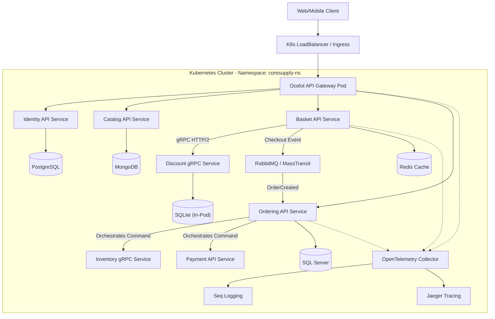
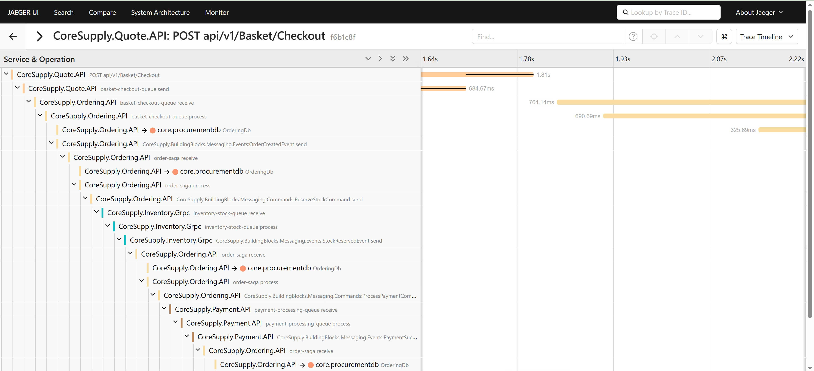

# 🏭 CoreSupply | Cloud-Native Industrial Supply Chain Platform

<!-- Tech Stack & Orchestration -->
[](https://dotnet.microsoft.com/)
[-326ce5?style=flat-square&logo=kubernetes)](https://kubernetes.io/)
[](https://www.docker.com/)
[](https://github.com/amirhosein2015/CoreSupply)

<!-- Architecture Patterns (Principal Engineering) -->
[](https://github.com/amirhosein2015/CoreSupply)
[](https://masstransit.io/documentation/patterns/saga)
[](https://learn.microsoft.com/en-us/dotnet/architecture/microservices/microservice-ddd-cqrs-patterns/)

<!-- Communication & Observability -->
[](https://masstransit.io/)
[-333333?style=flat-square&logo=grpc)](https://grpc.io/)
[](https://opentelemetry.io/)

<!-- Quality Assurance -->
[](https://github.com/amirhosein2015/CoreSupply/actions/workflows/dotnet-ci.yml)
[](https://xunit.net/)
[](LICENSE)

> **Enterprise-grade, Cloud-Native B2B solution for the DACH market, engineered with modern .NET 8 standards.**

**CoreSupply** is more than just an e-commerce backend; it is a **production-ready distributed system** architected to solve complex industrial procurement challenges. Unlike traditional monoliths, it leverages **Microservices**, **Event-Driven Architecture**, and **Kubernetes Orchestration** to ensure loose coupling, massive scalability, and fault tolerance.

The primary goal of this project is to demonstrate **Principal-level** engineering mastery, featuring advanced patterns like **Saga Orchestration**, **Distributed Tracing**, and **Resilient Cloud Deployment**.


---
## Problem Statement

Modern industrial supply chains — especially in sectors such as automotive, manufacturing, and large-scale distribution — face complex challenges in parts procurement, inventory coordination, and multi-party fulfillment workflows across factory and enterprise environments. Traditional monolithic procurement systems are often brittle, difficult to scale, and incapable of supporting distributed orchestration, eventual consistency, and operational transparency required for modern industrial and production-driven systems.

CoreSupply addresses these challenges by providing a cloud-native, microservices-based platform that enables resilient, scalable, and observable procurement workflows across business domains and factory operations. Using a combination of synchronous and asynchronous communication patterns, distributed transaction management (Saga orchestration), and advanced observability with end-to-end tracing and centralized logging, CoreSupply serves as a production-ready, enterprise-grade foundation for B2B parts supply systems operating in industrial and manufacturing contexts.

This platform is designed to support engineering teams building sophisticated supply chain and factory-integrated solutions for industries such as automotive manufacturing, industrial equipment production, and logistics, where reliability, extensibility, maintainability, and cloud readiness are critical to sustained operational excellence.

---
## 🏗️ High-Level Architecture (Kubernetes Cluster)

The system follows **Clean Architecture** principles and is deployed as a set of scalable pods within a **Kubernetes Cluster**, using a hybrid communication strategy (**Sync gRPC** for speed, **Async Messaging** for consistency).


---

## 🚀 Engineering Excellence & Patterns

This project demonstrates mastery of advanced software engineering concepts required for **Senior/Principal** roles.

### **1. Architecture & Design**
*   **Microservices:** Fully autonomous services with **Polyglot Persistence** (Mongo, SQL Server, Postgres, Redis, SQLite).
*   **Domain-Driven Design (DDD):** Rich domain models, Aggregates, and Value Objects implemented in the *Ordering Service*.
*   **CQRS:** Command Query Responsibility Segregation using **MediatR** to separate read/write concerns.
*   **Clean Architecture:** Strict separation of concerns (Domain, Application, Infrastructure, API).

### **2. Communication & Messaging**
*   **Event-Driven Architecture:** Asynchronous inter-service communication using **RabbitMQ** and **MassTransit**.
*   **Saga Orchestration:** Distributed Transaction Management (Order -> Inventory -> Payment) using **MassTransit State Machine**.
*   **Synchronous gRPC:** High-performance inter-service communication between *Basket* and *Discount* using ProtoBuf and HTTP/2.
*   **API Gateway:** Unified entry point using **Ocelot** for routing and aggregation.

### **3. Observability & DevOps**
*   **Distributed Tracing:** Full end-to-end request tracing using **OpenTelemetry** and **Jaeger**.
*   **Centralized Logging:** Structured logging aggregation using **[Serilog configuration](./CoreSupply.BuildingBlocks/Logging/LoggingExtensions.cs)** and **Seq**.
*   **Docker Compose:** Zero-config deployment via [docker-compose.yml](./docker-compose.yml).
*   **Deep Dive:** 👉 **[Read the Observability Guide](./docs/observability/observability-guide.md)**.

### **4. System Resilience**
*   **Fault Tolerance:** Implemented **Polly** retry policies inside [Ordering Program.cs](./CoreSupply.Ordering.API/Program.cs).
*   **Compensation Logic:** Automatic rollback (e.g., releasing stock if payment fails) handled by the Saga State Machine.
*   **Self-Healing:** Database migration and seeding strategies that handle container restarts gracefully.
*   **Deep Dive:** 👉 **[Read the Resilience & Fault Tolerance Guide](./docs/architecture/resilience-patterns.md)**.

### **5. Quality Assurance**
*   **Integration Testing:** Automated end-to-end testing using **[Testcontainers implementation](./CoreSupply.IntegrationTests/Fixtures/IntegrationTestWebAppFactory.cs)**.
*   **Unit/Integration Scenarios:** See **[OrderTests.cs](./CoreSupply.IntegrationTests/Fixtures/OrderTests.cs)** for real-world testing examples.
*   **Deep Dive:** 👉 **[Read the full Testing Strategy Guide](./docs/architecture/testing-strategy.md)** to understand how we handle CI/CD vs Local environments.

### **6. Security Architecture**
*   **Identity & Access:** Centralized JWT authentication with Refresh Token Rotation and RBAC authorization.
*   **Secrets Management:** Environment-based configuration following 12-Factor App principles (no hardcoded secrets).
*   **Deep Dive:** 👉 **[Read the Security Architecture Guide](./docs/architecture/security-architecture.md)**.

### **7. Cloud Infrastructure & DevOps**
*   **Kubernetes (K8s):** Full production-grade deployment manifests including `Deployments`, `Services`, `Secrets`, and `ConfigMaps`.
*   **Infrastructure as Code (IaC):** Declarative YAML configuration for the entire stack (Infrastructure + Application).
*   **Ingress Controller:** Traffic management and routing handled natively within the cluster.
*   **Deep Dive:** 👉 **[Explore the Kubernetes Manifests](./k8s/)** to see how we manage stateful and stateless workloads.

---

### **🚀 Deep Dive: Distributed Saga Orchestration**

One of the most complex challenges in distributed systems is managing transactions across multiple services. CoreSupply implements the **Orchestration-based Saga Pattern** using MassTransit State Machines to ensure data consistency.

**The Workflow (Order Fulfillment):**
1.  **Order Created:** The user checks out, and the order is saved in `Pending` state.
2.  **Orchestrator Starts:** The `OrderStateMachine` in *Ordering.API* initiates the transaction.
3.  **Inventory Check:** A command is sent to *Inventory Service*.
    *   ✅ Success: Proceeds to payment.
    *   ❌ Failure: Saga ends, Order marked as `Cancelled`.
4.  **Payment Processing:** A command is sent to *Payment Service*.
    *   ✅ Success: Order marked as `Completed`.
    *   ❌ Failure: **Compensation Action** triggers -> A `ReleaseStock` command is sent to Inventory to roll back the reservation.

> **Why Orchestration?** Unlike Choreography, this approach centralizes the business logic, making it easier to monitor, debug, and manage complex workflows with rollbacks.

---
## 🛠️ How to Run

You have two options to run CoreSupply: **Docker Compose** (Quick Start) or **Kubernetes** (Production Simulation).

### Prerequisites
*   [Docker Desktop](https://www.docker.com/products/docker-desktop) (Linux Containers mode).
*   **For K8s:** Enable Kubernetes in Docker Desktop settings.

---

### 🟢 Option 1: Docker Compose (Quick Start)
Best for development and debugging.

1.  **Clone & Launch:**
    ```bash
    git clone https://github.com/amirhosein2015/CoreSupply.git
    cd CoreSupply
    docker-compose up -d --build
    ```
    *Wait ~60 seconds for SQL Server to initialize.*

2.  **Access the System:**
    *   **Unified API Gateway:** `http://localhost:9000/catalog`
    *   **Log Dashboard (Seq):** `http://localhost:9880` (admin / Password12!)
    *   **Tracing (Jaeger):** `http://localhost:16686`
    *   **RabbitMQ:** `http://localhost:18672` (guest/guest)

---

### 🔵 Option 2: Kubernetes (Production Simulation)
Best for validating deployment manifests and microservices orchestration.

1.  **Setup Namespace & Secrets:**
    ```bash
    kubectl apply -f k8s/0-namespace.yaml
    kubectl apply -f k8s/0-secrets.yaml
    ```

2.  **Deploy Infrastructure (DBs, Broker):**
    ```bash
    kubectl apply -f k8s/1-infrastructure/
    ```

3.  **Deploy Microservices:**
    ```bash
    kubectl apply -f k8s/2-services/
    ```

4.  **Access (Port Forwarding):**
    Since Docker Desktop networking can vary, use port-forwarding to access the Gateway:
    ```bash
    kubectl port-forward svc/api-gateway 9000:80 -n coresupply-ns
    ```
    Now access APIs via `http://localhost:9000`.

---

## 📸 Visual Evidence

### 1. Distributed Tracing (Jaeger)
*End-to-End trace visualization of the Saga transaction (Basket -> Order -> Inventory -> Payment). Shows the exact latency and path of the request across microservices.*


### 2. Observability Dashboard (Seq)
*Real-time structured logging aggregation from all microservices, allowing for deep filtering and debugging.*


### 3. Automated Integration Tests
*Result of running the integration test suite, verifying the correctness of the API endpoints and database interactions.*


---


## 🔮 Roadmap (Principal Level Goals)

| Phase | Status | Feature | Details |
| :--- | :--- | :--- | :--- |
| **1. Foundation** | ✅ Done | Microservices & Infrastructure | Docker, Polyglot Persistence, Event Bus setup. |
| **2. Security** | ✅ Done | Advanced Auth | Refresh Tokens, RBAC, Secrets Management. |
| **3. Communication** | ✅ Done | gRPC Integration | Synchronous, high-performance link between Basket & Discount. |
| **4. Orchestration** | ✅ Done | **Saga Pattern** | Implemented Distributed Transactions (Order -> Inventory -> Payment). |
| **5. Observability** | ✅ Done | **Distributed Tracing** | Implemented OpenTelemetry and Jaeger for full request visualization. |
| **6. Deployment** | ✅ Done | **Kubernetes (K8s)** | Full deployment manifests for Infrastructure and Services. |
| **7. Frontend** | ⏳ Next | **B2B Enterprise Portal** | Developing a modern SPA using **React 18 & TypeScript** with Material UI. |

---

## 👨‍💻 Author

**Abdollah Mohajeri**
*   *Senior Software Engineer & Cloud Architect*
*   Focus: Distributed Systems, .NET Ecosystem, Cloud-Native Solutions.
*   GitHub: [amirhosein2015](https://github.com/amirhosein2015)

---
*Designed with ❤️ for the Industrial Sector.*
```
